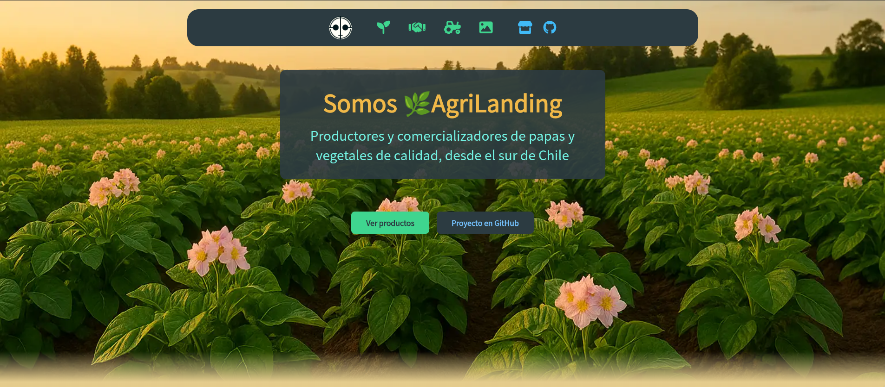
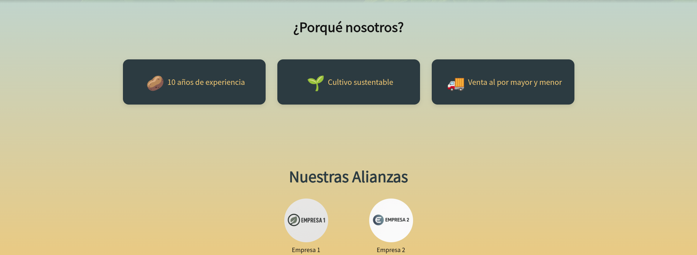
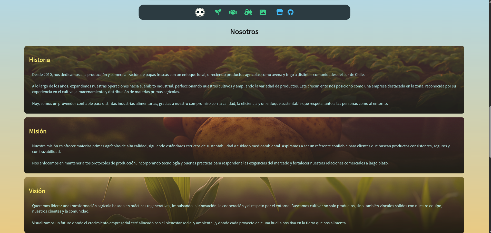
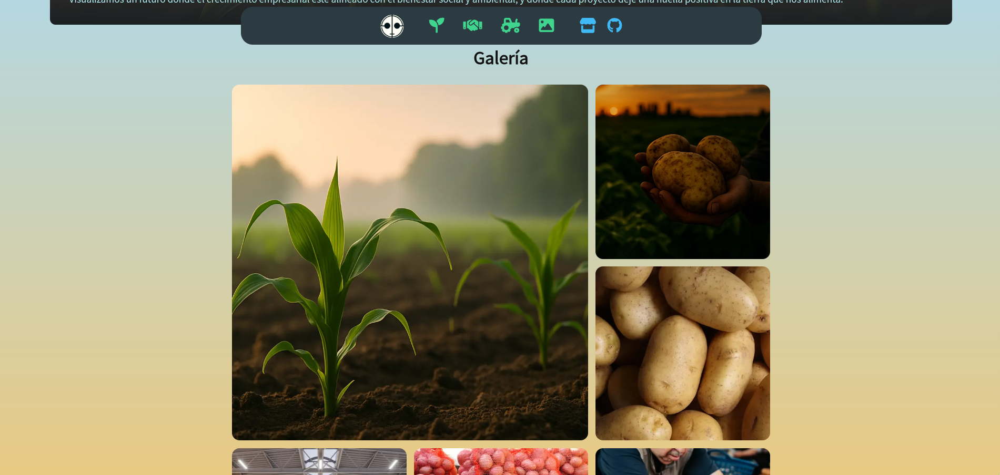
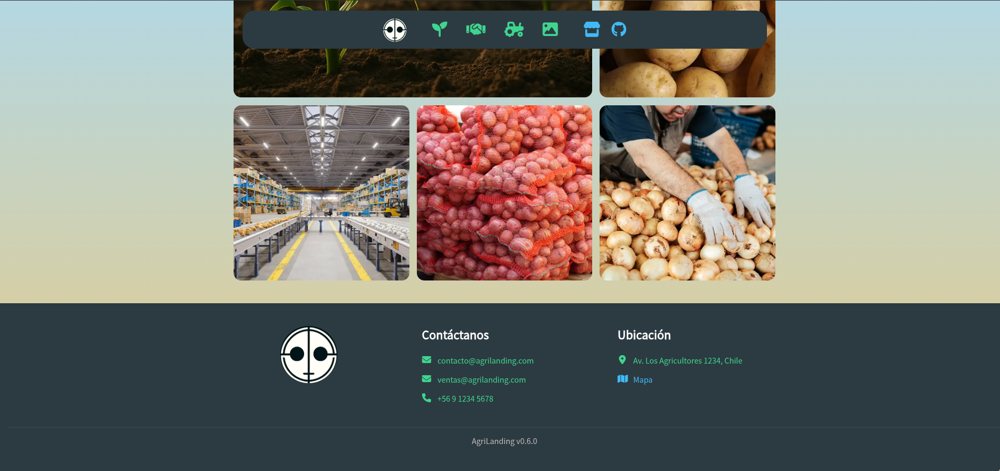

# AgriLanding — Plantilla Web para el Sector Agrícola


Landing page pensada para empresas del sector agrícola. Construida intencionalmente con HTML y CSS puro para demostrar dominio de fundamentos web sin dependencia de frameworks.

**Demo en vivo:** [shadec0der.github.io/Template-AgriLanding](https://shadec0der.github.io/Template-AgriLanding/)

## Vista previa



| Por qué nosotros & Alianzas | Nosotros | Galería | Footer |
|-----------------------------|----------|---------|--------|
|  |  |  |  |

---

## Estructura del proyecto

```
Template-AgriLanding/
├── index.html
└── assets/
    ├── css/
    │   ├── base.css
    │   ├── navbar.css
    │   ├── hero.css
    │   ├── why-us.css
    │   ├── alliances.css
    │   ├── us.css
    │   ├── gallery.css
    │   └── footer.css
    ├── img/
    │   ├── general/
    │   ├── gallery/
    │   ├── alliances/
    │   └── us/
    └── icons/
```

---

## Características

- Diseño responsive (mobile-first)
- Secciones: Hero, Por qué nosotros, Alianzas, Nosotros, Galería
- Navegación con iconos (Font Awesome)
- CSS modular por sección
- Estructura semántica con HTML5

---

## Cómo usar

1. Clona o descarga este repositorio:
   ```bash
   git clone https://github.com/ShadeC0der/Template-AgriLanding.git
   ```
2. Abre `index.html` en tu navegador — no requiere servidor ni dependencias.
3. Personaliza textos e imágenes desde `assets/`.
4. Adapta los estilos en `assets/css/` sección por sección.

---

## Contexto

Este proyecto es una reinterpretación independiente de un sitio real desarrollado en un entorno laboral ([Agrícola La Excelencia](https://agricolalaexcelencia.cl/)). El código original pertenece a la empresa; esta versión fue reescrita desde cero como ejercicio de mejora, aplicando prácticas aprendidas desde esa experiencia inicial.

---

## Autor

**[ShadeC0der](https://github.com/ShadeC0der)**
